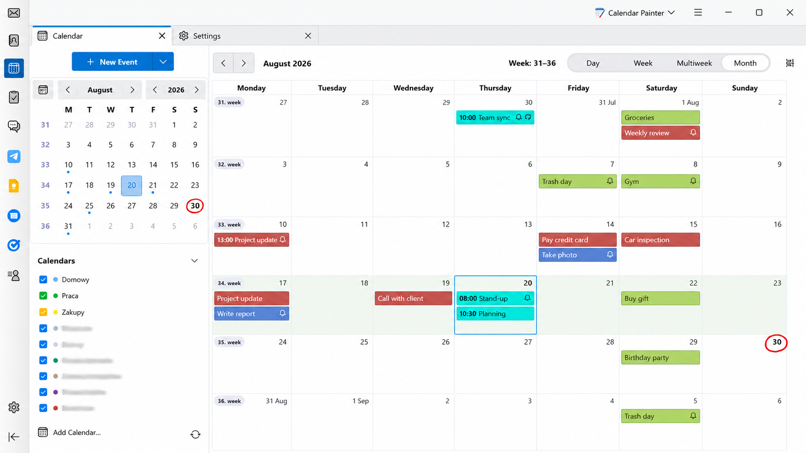
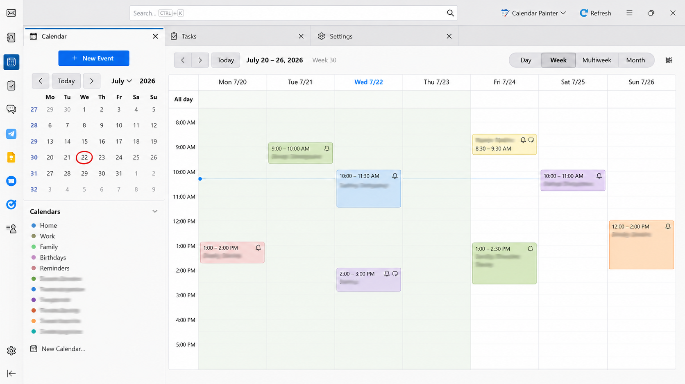
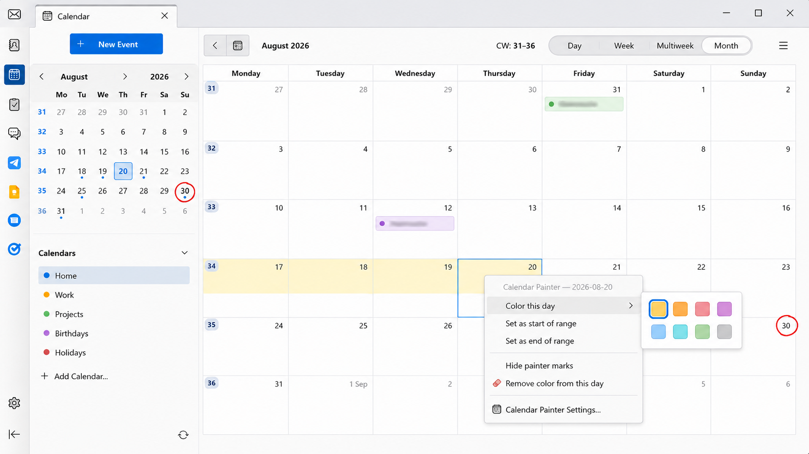
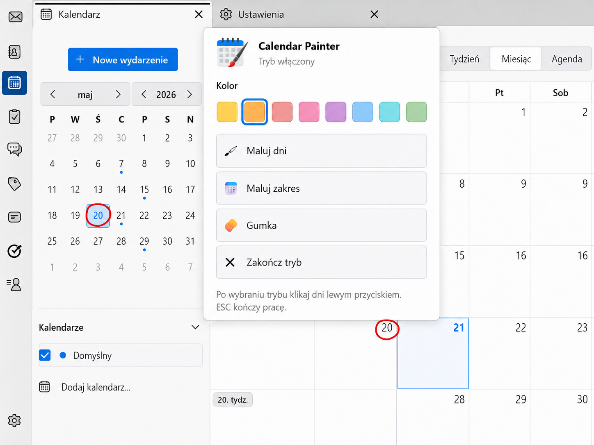

# Calendar Painter

## ⬇️ Download / Pobierz

### [Download the latest version / Pobierz najnowszą wersję](https://github.com/arturpu/Calendar-Painter/releases/latest)

Download the `.xpi` file from the latest release.

Pobierz plik `.xpi` z najnowszego wydania.

## Screenshots

### Month view

### Week view

### Context menu

### Painter popup

## English

Calendar Painter is a Thunderbird extension for visually marking days in the built-in calendar without creating artificial all-day events.

### Features
- Paint individual days.
- Paint date ranges.
- Erase applied colors.
- Colors persist after restarting Thunderbird.
- Saved colors are also reflected in Day/Week view.
- Optional hand-drawn red circle marking today in both the main calendar and the sidebar mini-calendar.
- Polish and English interface; the extension follows Thunderbird's UI language.
- Toolbar button in the Calendar space.

### Compatibility
- Thunderbird 153.0 and newer.
- No strict maximum Thunderbird version is declared, so ordinary Thunderbird updates do not disable the extension only because the version number changed.
- Calendar Painter uses an Experiment API and may require maintenance if Thunderbird makes major internal calendar changes.

### Installation
Download the `.xpi` file, open Thunderbird's Add-ons Manager, choose **Install Add-on From File…**, and select the downloaded file.

### Important
Calendar Painter changes only the visual presentation of calendar days. It does not create, edit or synchronize calendar events.

---

## Polski

Calendar Painter to dodatek do Thunderbirda pozwalający wizualnie oznaczać dni we wbudowanym kalendarzu bez tworzenia sztucznych wydarzeń całodniowych.

### Funkcje
- Kolorowanie pojedynczych dni.
- Kolorowanie zakresów dat.
- Gumka do usuwania kolorów.
- Zachowanie kolorów po ponownym uruchomieniu Thunderbirda.
- Zapisane kolory są widoczne również w widoku Dzień/Tydzień.
- Opcjonalne odręczne czerwone kółko wokół dzisiejszej daty.
- Polski i angielski interfejs; język jest dobierany do języka Thunderbirda.
- Przycisk dodatku w przestrzeni Kalendarza.

### Zgodność
- Thunderbird 153.0 i nowszy.
- Brak sztywnej maksymalnej wersji Thunderbirda, więc zwykłe aktualizacje nie wyłączają dodatku wyłącznie z powodu zmiany numeru wersji.
- Dodatek korzysta z Experiment API i po dużych zmianach wewnętrznych Thunderbirda może wymagać aktualizacji.

### Instalacja
Pobierz plik `.xpi`, otwórz Menedżera dodatków Thunderbirda, wybierz **Zainstaluj dodatek z pliku…** i wskaż pobrany plik.

### Ważne
Calendar Painter zmienia wyłącznie wygląd dni kalendarza. Nie tworzy, nie edytuje i nie synchronizuje wydarzeń.
